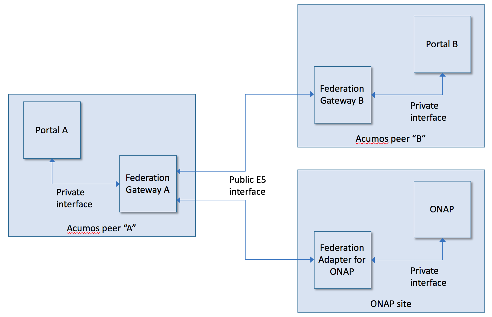

.. ===============LICENSE_START=======================================================
.. Acumos CC-BY-4.0
.. ===================================================================================
.. Copyright (C) 2017 AT&T Intellectual Property & Tech Mahindra. All rights reserved.
.. ===================================================================================
.. This Acumos documentation file is distributed by AT&T and Tech Mahindra
.. under the Creative Commons Attribution 4.0 International License (the "License");
.. you may not use this file except in compliance with the License.
.. You may obtain a copy of the License at
..
.. http://creativecommons.org/licenses/by/4.0
..
.. This file is distributed on an "AS IS" BASIS,
.. WITHOUT WARRANTIES OR CONDITIONS OF ANY KIND, either express or implied.
.. See the License for the specific language governing permissions and
.. limitations under the License.
.. ===============LICENSE_END=========================================================

===========================
Federation Gateway Overview
===========================

The Acumos Federation Gateway feature provides a mechanism to exchange models
between two Acumos instances via a secure network channel.
The goal was to have a mechanism that provides great flexibility when designing a deployment.
The Gateway feature does not define how multiple Acumos instances are to be interconnected
or what roles they play.

Like many other system components, the Gateway is implemented as a server that listens 
for requests on a REST API.  The Gateway provides two interfaces, both using REST:

* Public: towards peers (also known as the "E5" interface)
* Private: changes between gateway and different adapter implementations

Architecture
------------

The following picture shows how the gateway components communicate with each other and with
other Acumos features.  All communication is secured by use of client and server certificates.

Developer Resources
-------------------
The source is available from the Linux Foundation Gerrit server:
 
    `<https://gerrit.acumos.org/r/gitweb?p=federation.git;a=summary>`_

The build (CI) jobs are in the Linux Foundation Jenkins server:

    `<https://jenkins.acumos.org/view/federation/>`_

Issues are tracked in the Linux Foundation Jira server:

    `<https://jira.acumos.org/secure/Dashboard.jspa>`_

Project information is available in the Linux Foundation Wiki:

    `<https://wiki.acumos.org/>`_
